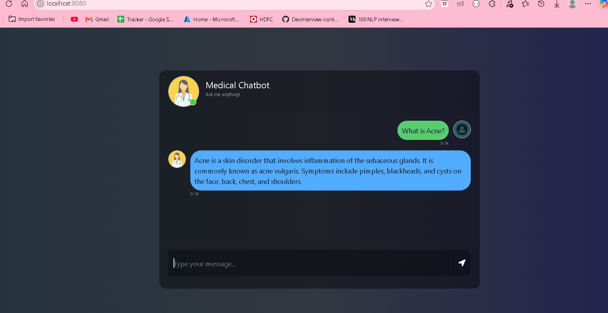

# 🩺 Medical Chatbot using Generative AI

A smart AI-powered Medical Chatbot that allows users to ask health-related questions and receive relevant responses based on medical documents using Retrieval-Augmented Generation (RAG).

The chatbot uses Large Language Models (LLMs), vector embeddings, and semantic search to retrieve accurate information from a medical knowledge base.

---

## 🚀 Features

- 💬 Interactive chat interface
- 📄 Reads medical PDF documents
- ✂️ Splits documents into chunks
- 🔍 Converts text into vector embeddings
- 🗂️ Stores embeddings in a vector database
- 🤖 Uses LLMs to generate intelligent responses
- ⚡ Fast semantic search using RAG architecture

---

## 🏗️ Tech Stack

- Python 3.10
- LangChain
- Flask
- Pinecone Vector Database
- Hugging Face Embeddings
- OpenAI / LLM API
- HTML, CSS, JavaScript

---

## 📂 Project Structure

```

Medical-chatbot/
│
├── app.py                  # Flask application
├── src/
│   ├── helper.py           # PDF loading & processing
│   └── prompt.py           # Prompt template
│
├── templates/
│   └── chat.html           # Chatbot frontend UI
│
├── static/
│   └── style.css           # CSS styles
│
├── research/
│   └── trials.ipynb        # Experiments
│
├── requirements.txt        # Required packages
├── .env                    # Environment variables
├── setup.py                # Project setup
├── template.sh             # Creates project structure
└── README.md

```

---

## ⚙️ Installation

### 1. Clone the repository

```bash
git clone https://github.com/shreya-peyyala300/Medical-chatbot.git
```

### 2. Create Conda environment

```bash
conda create -n medibot python=3.10 -y
```

### 3. Activate the environment

```bash
conda activate medibot
```

### 4. Create project structure

```bash
sh template.sh
```

### 5. Install dependencies

```bash
pip install -r requirements.txt
```

---

## 🔐 Environment Variables

Create a `.env` file in the root directory and add your API keys:

```env
PINECONE_API_KEY=your_pinecone_api_key
OPENAI_API_KEY=your_openai_api_key
```

---

## 📥 Prepare Vector Database

Run the data ingestion script to load PDF documents, create embeddings, and store them in Pinecone.

```bash
python store_index.py
```

---

## ▶️ Run the Application

Start the Flask server:

```bash
python app.py
```

The application will run at:

```
http://localhost:8080
```

Open the URL in your browser and start chatting with the Medical Assistant.

---

## 🧠 RAG Architecture

```
User Question
      |
      v
Embedding Model
      |
      v
Pinecone Vector Search
      |
      v
Relevant Medical Chunks
      |
      v
LLM
      |
      v
Generated Answer
```

---

## 📸 Demo

Add screenshots or a demo GIF of your chatbot here.

Example:

```

```

---

## 🔮 Future Improvements

- Add user authentication
- Store chat history
- Improve medical answer accuracy
- Add voice-based interaction
- Deploy the application on cloud

---

## ⚠️ Disclaimer

This chatbot provides information for educational purposes only and should not be considered professional medical advice. Always consult a qualified healthcare professional for medical concerns.

---

## 👨‍💻 Author

**Shreya Peyyala**

GitHub: https://github.com/shreya-peyyala300
